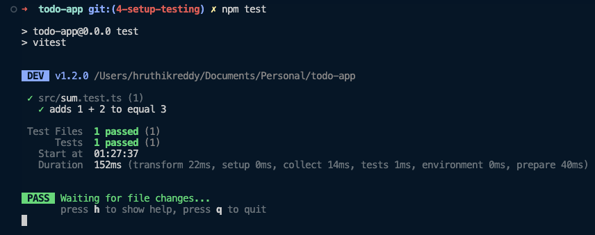

import { Steps, Callout } from 'nextra/components';

# Setup Testing

Testing is tedius. Testing is boring. Developers avoid it.

Testing is important. Testing is necessary. Developers need to do it.

Manual testing is expensive and time consuming. Automated testing is cheap and fast.

Also, there are not a lot of testing tutorials out there as much as there are tutorials on how to build a web app.

This causes a lot of developers to avoid testing just because of their lack of understading of the process and the tools. Even I don't like testing as a frontend developer. But I have a system that works for me and I want to share it with you.

But first, we need to setup our tools.

## Vitest

Since we are using Vite, we greatly benefit from a native testing solution which is Vitest. You can read more about [Why Vitest here](https://vitest.dev/guide/why.html).

Most companies out there use Jest for testing. Luckily, Vitest is compatible with Jest.

Either way, we need to install Vitest first. Run the following command in your terminal:

```sh
npm install -D vitest
```

Let us test if Vitest is working. The following steps are directly taken from the docs [here](https://vitest.dev/guide/#writing-tests).

<Steps>
### Create a file called `sum.ts` inside the `src` folder. Paste the following code inside it:

```ts filename="./src/sum.ts"
export function sum(a: number, b: number) {
  return a + b;
}
```

### Similarly, create a file called `sum.test.ts` inside the `src` folder. Paste the following code inside it:

```ts filename="./src/sum.test.ts"
import { expect, test } from 'vitest';
import { sum } from './sum';

test('adds 1 + 2 to equal 3', () => {
  expect(sum(1, 2)).toBe(3);
});
```

### Update yours `package.json` file to include the following script:

```json {7} filename="./package.json"
{
  // Rest of the file omitted for brevity

  "scripts": {
    "dev": "vite",
    "build": "tsc && vite build",
    "test": "vitest",
    "lint": "eslint . --ext ts,tsx --report-unused-disable-directives --max-warnings 0",
    "preview": "vite preview",
    "prepare": "husky install"
  }

  // Rest of the file omitted for brevity
}
```

### Run the following command in your terminal:

```sh
npm run test
```

And then, you should see something like this:


</Steps>

In fact, this little test we wrote is what we call a `unit test`. It is a test that tests a small unit of code. In this case, we are testing the `sum` function.

These kinds of tests are very important because they test the small units of code that make up your app.

Also, using a **TDD** (Test Driven Development) approach is easier with unit tests. You can straight away write the unit tests and then write the code to make the tests pass.

Okay, now that we have Vitest setup. We just need one more tool to finish our setup.

## React Testing Library (RTL)

<Callout>
I would first highly recommend: 
- You read the guiding principles of testing library [here](https://testing-library.com/docs/guiding-principles).
- You read the blog post on __Testing Implementation Details__ by Kent C. Dodds [here](https://kentcdodds.com/blog/testing-implementation-details).

</Callout>

Either way, we need to install RTL so that we can test our React components. Run the following command in your terminal:

```sh
npm install -D @testing-library/react
```

Also, since we use Vitest and not Jest ([read more here](https://testing-library.com/docs/react-testing-library/setup#using-without-jest)), we have to install a test environment called `jsdom`. Run the following command in your terminal:

```sh
npm install -D jsdom
```

## Configuring Vitest and React Testing Library

Now that we have all the tools installed, we need to configure them. This is pretty simple and is usually only done once and never touched again.

But to figure out the actual configuration can be painful. I'd suggest going through the docs at a time when you are not tired and can focus on the task at hand.

The best part about configuring Vitest is that we can use our existing `vite.config.ts` file. We just need to add a few lines of code to it.

```ts {1, 8-10} filename="./vite.config.ts"
/// <reference types="vitest" />
import { defineConfig } from 'vite';
import react from '@vitejs/plugin-react';

// https://vitejs.dev/config/
export default defineConfig({
  plugins: [react()],
  test: {
    environment: 'jsdom',
  },
});
```

We got this configuration from the docs [here](https://vitest.dev/config/#configuring-vitest). There might be more configuration and packages required but we will figure that out as we need.

Great, we can now start writing our first real tests.

At this point your code should be a good match to the branch of the repository: [4-setup-testing](https://github.com/Frontend-Hire/todo-app-react-tdd-typescript/tree/4-setup-testing)
