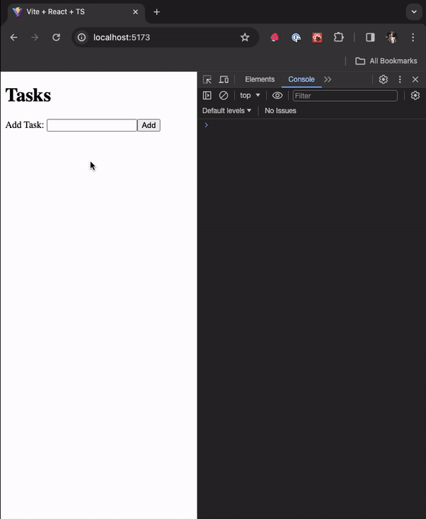
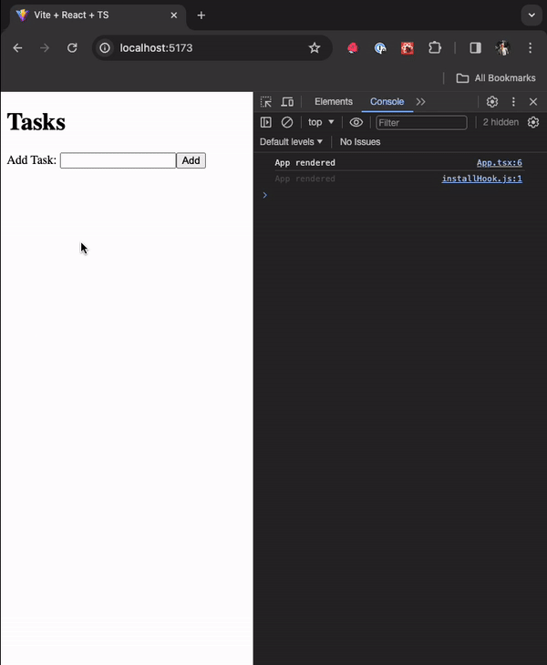
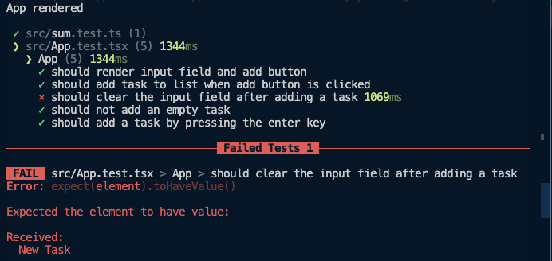

import { Callout } from 'nextra/components';

# Refactoring

In this section, we'll discuss why refactoring is important, and how to do it.

## Why Refactor?

We'd like to list a few reasons why refactoring is important:

- The first lines of code you write are usually not the best. You'll learn more about the problem you're solving as you go, and you'll find better ways to solve it.

- Refactoring is basically the process of improving your code by writing it in a better way. 

- Refactoring is a way to improve the design of your code. It's a way to make your code more readable, more maintainable, and more extensible.

- We always read more code than we write. So, it's important to write code that's easy to read and understand.

Now of course, the topic of refactoring is huge. There are entire books written about it. So, we just covered the bare minimum here. In our case, we'll focus on our code to make it more readable, maintainable, extensible, and some performance improvements.

### Let's see our current file that contains the entire code for the Todo App

```tsx showLineNumbers filename="./src/App.tsx"
import React from 'react';

type Priority = 'p1' | 'p2' | 'p3';

type Task = {
  id: number;
  title: string;
  isCompleted: boolean;
  priority?: Priority;
};

function App() {
  const [tasks, setTasks] = React.useState<Task[]>([]);

  const [taskName, setTaskName] = React.useState('');

  const onAddTask = () => {
    const trimmedTaskName = taskName.trim();

    if (!trimmedTaskName) {
      return;
    }

    setTasks([
      ...tasks,
      {
        id: new Date().getTime(), // Not a great way to generate IDs
        title: trimmedTaskName,
        isCompleted: false,
      },
    ]);

    setTaskName('');
  };

  const onInputKeyDown = (e: React.KeyboardEvent<HTMLInputElement>) => {
    if (e.key === 'Enter') {
      onAddTask();
    }
  };

  return (
    <div>
      <h1>Tasks</h1>
      <label htmlFor="task-input">Add Task: </label>
      <input
        id="task-input"
        value={taskName}
        onChange={(e) => setTaskName(e.target.value)}
        onKeyDown={onInputKeyDown}
      />
      <button onClick={onAddTask}>Add</button>
      <ul>
        {tasks.map((task) => (
          <li key={task.id}>{task.title}</li>
        ))}
      </ul>
    </div>
  );
}

export default App;
```

Honestly, this is not a bad code and seems easy to read with around 62 lines of code. But we can still improve it. Here are couple of things we find that can be improved:

- The `Task` type is defined inside the `App` component. This is not a good practice. We should move it outside the component.

- The input has a good amount of logic that can be extracted into a separate component.

Let's do these two things first. Of course, refactoring is a continuous process. So, we'll keep improving our code as we go.

### Moving the `Task` type outside the `App` component

Let's move the `Task` type outside the `App` component. We'll create a new file called `types.ts` inside the `src` folder, and move the `Task` type there. We'll also move the `Priority` type there as well.

```tsx showLineNumbers {1-8} filename="./src/types.ts"
type Priority = 'p1' | 'p2' | 'p3';

export type Task = {
  id: number;
  title: string;
  isCompleted: boolean;
  priority?: Priority;
};
```

Export the `Task` type from the `types.ts` file, and import it in the `App` component.

```tsx showLineNumbers {2} filename="./src/App.tsx"
import React from 'react';
import { Task } from './types';

// Rest of the code omitted for brevity
```

Our main file is already 10 lines shorter. Let's move on to the next step.

### Extracting the input into a separate component

Let's create a new file called `TaskInput.tsx` inside the `src` folder. We'll move the input and the respective label into this file.

```tsx showLineNumbers {1-13} filename="./src/TaskInput.tsx"
export default function TaskInput() {
  return (
    <>
      <label htmlFor="task-input">Add Task: </label>
      <input
        id="task-input"
        value={taskName}
        onChange={(e) => setTaskName(e.target.value)}
        onKeyDown={onInputKeyDown}
      />
    </>
  );
}
```

Of course, this won't work because we're using `taskName`, `setTaskName`, and `onInputKeyDown` inside the `Input` component. We'll pass these as props to the `TaskInput` component.

```tsx showLineNumbers {1-5, 7-11} filename="./src/TaskInput.tsx"
type TaskInputProps = {
  taskName: string;
  setTaskName: (taskName: string) => void;
  onInputKeyDown: (e: React.KeyboardEvent<HTMLInputElement>) => void;
};

export default function TaskInput({
  taskName,
  setTaskName,
  onInputKeyDown,
}: TaskInputProps) {
  return (
    <>
      <label htmlFor="task-input">Add Task: </label>
      <input
        id="task-input"
        value={taskName}
        onChange={(e) => setTaskName(e.target.value)}
        onKeyDown={onInputKeyDown}
      />
    </>
  );
}
```

Let's use the new `TaskInput` component in the `App`.

```tsx showLineNumbers {3, 11-15} filename="./src/App.tsx"
import React from 'react';
import { Task } from './types';
import TaskInput from './TaskInput';

function App() {
  // Some of the code omitted for brevity

  return (
    <div>
      <h1>Tasks</h1>
      <TaskInput
        taskName={taskName}
        setTaskName={setTaskName}
        onInputKeyDown={onInputKeyDown}
      />
      <button onClick={onAddTask}>Add</button>
      <ul>
        {tasks.map((task) => (
          <li key={task.id}>{task.title}</li>
        ))}
      </ul>
    </div>
  );
}

// Rest of the code omitted for brevity
```

Honestly, this is not a huge improvement at all, we just abstracted the label and input into a separate component. Also, the number of lines have barely changed.

But let's have a good look at our component. Can we maybe also move the button to our new `TaskInput` component? Let's try that.

```tsx showLineNumbers {5, 12, 23} filename="./src/TaskInput.tsx"
type TaskInputProps = {
  taskName: string;
  setTaskName: (taskName: string) => void;
  onInputKeyDown: (e: React.KeyboardEvent<HTMLInputElement>) => void;
  onAddTask: () => void;
};

export default function TaskInput({
  taskName,
  setTaskName,
  onInputKeyDown,
  onAddTask,
}: TaskInputProps) {
  return (
    <>
      <label htmlFor="task-input">Add Task: </label>
      <input
        id="task-input"
        value={taskName}
        onChange={(e) => setTaskName(e.target.value)}
        onKeyDown={onInputKeyDown}
      />
      <button onClick={onAddTask}>Add</button>
    </>
  );
}
```

We'll also pass the `onAddTask` function to the `TaskInput` component.

```tsx showLineNumbers {13} filename="./src/App.tsx"
// Rest of the code omitted for brevity

function App() {
  // Some of the code omitted for brevity

  return (
    <div>
      <h1>Tasks</h1>
      <TaskInput
        taskName={taskName}
        setTaskName={setTaskName}
        onInputKeyDown={onInputKeyDown}
        onAddTask={onAddTask}
      />
      <ul>
        {tasks.map((task) => (
          <li key={task.id}>{task.title}</li>
        ))}
      </ul>
    </div>
  );
}

// Rest of the code omitted for brevity
```

We are getting there. Let's also think of a better name for the `TaskInput` component. We'll rename it to `AddTask`. Also, we'll rename to file to `AddTask.tsx`.

```tsx showLineNumbers {1, 5, 10} filename="./src/AddTask.tsx"
type AddTaskProps = {
  // Some of the code omitted for brevity
};

export default function AddTask({
  taskName,
  setTaskName,
  onInputKeyDown,
  onAddTask,
}: AddTaskProps) {
  // Some of the code omitted for brevity
}
```

Our `App` component also needs to be updated with the new name.

```tsx showLineNumbers {2, 10} filename="./src/App.tsx"
// Rest of the code omitted for brevity
import AddTask from './AddTask';

function App() {
  // Some of the code omitted for brevity

  return (
    <div>
      <h1>Tasks</h1>
      <AddTask
        taskName={taskName}
        setTaskName={setTaskName}
        onInputKeyDown={onInputKeyDown}
        onAddTask={onAddTask}
      />
      {/* Some of the code omitted for brevity */}
    </div>
  );
}

// Rest of the code omitted for brevity
```

Now, we can also move the `onInputKeyDown` function to the `AddTask` component as it just calls the `onAddTask` function. Also, let's update the props accordingly.

```tsx showLineNumbers {1-5, 7-16} filename="./src/AddTask.tsx"
type AddTaskProps = {
  taskName: string;
  setTaskName: (taskName: string) => void;
  onAddTask: () => void;
};

export default function AddTask({
  taskName,
  setTaskName,
  onAddTask,
}: AddTaskProps) {
  const onInputKeyDown = (e: React.KeyboardEvent<HTMLInputElement>) => {
    if (e.key === 'Enter') {
      onAddTask();
    }
  };

  // Rest of the code omitted for brevity
}
```

We'll also update the `App` component accordingly.

```tsx showLineNumbers {32-36} filename="./src/App.tsx"
import React from 'react';
import { Task } from './types';
import AddTask from './AddTask';

function App() {
  const [tasks, setTasks] = React.useState<Task[]>([]);

  const [taskName, setTaskName] = React.useState('');

  const onAddTask = () => {
    const trimmedTaskName = taskName.trim();

    if (!trimmedTaskName) {
      return;
    }

    setTasks([
      ...tasks,
      {
        id: new Date().getTime(), // Not a great way to generate IDs
        title: trimmedTaskName,
        isCompleted: false,
      },
    ]);

    setTaskName('');
  };

  return (
    <div>
      <h1>Tasks</h1>
      <AddTask
        taskName={taskName}
        setTaskName={setTaskName}
        onAddTask={onAddTask}
      />
      <ul>
        {tasks.map((task) => (
          <li key={task.id}>{task.title}</li>
        ))}
      </ul>
    </div>
  );
}

export default App;
```

Now we can see some reduction in the number of lines. Now, there is one more refactoring we can do that would actually improve the performance of our app.

### Let's see the performance problem in our app

Put up a console.log inside the `App` component and see how many times it's being called when we type something in the input.

```tsx showLineNumbers {4} filename="./src/App.tsx"
// Rest of the code omitted for brevity

function App() {
  console.log('App rendered');

  // Rest of the code omitted for brevity
}

// Rest of the code omitted for brevity
```



### Why is the `App` component being rendered so many times?

It all has to do with where our state is located. We have two states in our app: `tasks` and `taskName`. The respective state is updated at different places in our app. The `tasks` state is updated inside the `onAddTask` function, and the `taskName` state is updated inside the `setTaskName` function.

```tsx showLineNumbers {6, 8, 17-24, 26, 34} filename="./src/App.tsx"
// Rest of the code omitted for brevity

function App() {
  console.log('App rendered');

  const [tasks, setTasks] = React.useState<Task[]>([]);

  const [taskName, setTaskName] = React.useState('');

  const onAddTask = () => {
    const trimmedTaskName = taskName.trim();

    if (!trimmedTaskName) {
      return;
    }

    setTasks([
      ...tasks,
      {
        id: new Date().getTime(), // Not a great way to generate IDs
        title: trimmedTaskName,
        isCompleted: false,
      },
    ]);

    setTaskName('');
  };

  return (
    <div>
      <h1>Tasks</h1>
      <AddTask
        taskName={taskName}
        setTaskName={setTaskName}
        onAddTask={onAddTask}
      />
      <ul>
        {tasks.map((task) => (
          <li key={task.id}>{task.title}</li>
        ))}
      </ul>
    </div>
  );
}

// Rest of the code omitted for brevity
```

Now, we could argue that the `App` component should be rendered when the `tasks` state is updated, but not when the `taskName` state is updated. And we're right. But React doesn't know that. React will re-render the `App` component whenever any state inside the `App` is updated. And that's why the `App` component is being rendered so many times.

But we know that the `taskName` state is only used inside the `AddTask` component. So, we can move the `taskName` state inside the `AddTask` component. Let's do that.

```tsx showLineNumbers {1, 3-5, 7-8, 12, 25} filename="./src/AddTask.tsx"
import React from 'react';

type AddTaskProps = {
  onAddTask: (taskName: string) => void;
};

export default function AddTask({ onAddTask }: AddTaskProps) {
  const [taskName, setTaskName] = React.useState('');

  const onInputKeyDown = (e: React.KeyboardEvent<HTMLInputElement>) => {
    if (e.key === 'Enter') {
      onAddTask(taskName);
    }
  };

  return (
    <>
      <label htmlFor="task-input">Add Task: </label>
      <input
        id="task-input"
        value={taskName}
        onChange={(e) => setTaskName(e.target.value)}
        onKeyDown={onInputKeyDown}
      />
      <button onClick={() => onAddTask(taskName)}>Add</button>
    </>
  );
}
```

We had to update our types as the `App` component now needs to know what task is sent by the `AddTask` component.

Let us also clean the `App` component.

```tsx showLineNumbers {10, 30} filename="./src/App.tsx"
import React from 'react';
import { Task } from './types';
import AddTask from './AddTask';

function App() {
  console.log('App rendered');

  const [tasks, setTasks] = React.useState<Task[]>([]);

  const onAddTask = (taskName: string) => {
    const trimmedTaskName = taskName.trim();

    if (!trimmedTaskName) {
      return;
    }

    setTasks([
      ...tasks,
      {
        id: new Date().getTime(), // Not a great way to generate IDs
        title: trimmedTaskName,
        isCompleted: false,
      },
    ]);
  };

  return (
    <div>
      <h1>Tasks</h1>
      <AddTask onAddTask={onAddTask} />
      <ul>
        {tasks.map((task) => (
          <li key={task.id}>{task.title}</li>
        ))}
      </ul>
    </div>
  );
}

export default App;
```

Try typing something in the input now. You'll see that the `App` component is not being rendered anymore unless a new task is added which is expected.



<Callout>
  I want to mention that this is not a huge performance problem. But it's a good example to show how we can improve the performance of our app without fancy tools like useCallback, useMemo, etc. In fact, in this case even those tools won't help us much.
</Callout>

### Oops, We seem to have broken something

If you try to add a new task now, you'll see that the input is not being cleared. That's because the `taskName` state is now inside the `AddTask` component. So, we need to clear the input inside the `AddTask` component. 

Though we saw this issue visually, we could have also caught this issue by running our existing tests. In fact, some of our functionality might not always caught visually. So, it's always a good idea to run our tests after refactoring (in fact have it running while refactoring too).

Let's run our tests.

```sh
npm test
```



We can see that the `Input Clear Test` is failing. Let's fix it.

```tsx showLineNumbers {10-19, 23, 36} filename="./src/AddTask.tsx"
import React from 'react';

type AddTaskProps = {
  onAddTask: (taskName: string) => void;
};

export default function AddTask({ onAddTask }: AddTaskProps) {
  const [taskName, setTaskName] = React.useState('');

  const handleAddTask = () => {
    const trimmedTaskName = taskName.trim();

    if (!trimmedTaskName) {
      return;
    }

    onAddTask(trimmedTaskName);
    setTaskName('');
  };

  const onInputKeyDown = (e: React.KeyboardEvent<HTMLInputElement>) => {
    if (e.key === 'Enter') {
      handleAddTask();
    }
  };

  return (
    <>
      <label htmlFor="task-input">Add Task: </label>
      <input
        id="task-input"
        value={taskName}
        onChange={(e) => setTaskName(e.target.value)}
        onKeyDown={onInputKeyDown}
      />
      <button onClick={handleAddTask}>Add</button>
    </>
  );
}
```

We are proxying the `onAddTask` function inside the `handleAddTask` function. This enables us to add more logic to the `handleAddTask` function, in this case clearing the input and passing the trimmed task to the parent, without affecting the `onAddTask` function. This also cleans up the `App` component.

```tsx showLineNumbers {8-17} filename="./src/App.tsx"
import React from 'react';
import { Task } from './types';
import AddTask from './AddTask';

function App() {
  const [tasks, setTasks] = React.useState<Task[]>([]);

  const onAddTask = (taskName: string) => {
    setTasks([
      ...tasks,
      {
        id: new Date().getTime(), // Not a great way to generate IDs
        title: taskName,
        isCompleted: false,
      },
    ]);
  };

  return (
    <div>
      <h1>Tasks</h1>
      <AddTask onAddTask={onAddTask} />
      <ul>
        {tasks.map((task) => (
          <li key={task.id}>{task.title}</li>
        ))}
      </ul>
    </div>
  );
}

export default App;
```

Our tests are passing now and we have a lot cleaner code. 

We saw how having good tests can help us also maintain good code quality. We also saw how we can improve the performance of our app by moving the state to the right place.

This was a very simple example of refactoring. But we hope you got the idea of how to refactor our code.

This is the end of this section. In the next section, we'll discuss component composition.

At this point your code should be a good match to the branch of the repository: [7-refactoring](https://github.com/yaralahruthik/todo-app/tree/7-refactoring)