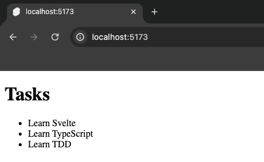

import { Callout } from 'nextra/components';

# Reading Tasks

In this section, we'll create the structure for our tasks and render them to the screen.

Also, run the dev server and open the respective dev URL as shown by Vite in your browser.

```sh
npm run dev
```

## Hardcoding Tasks

Let's start by hardcoding some tasks and rendering them to the screen. 

```svelte showLineNumbers {1-7} filename="src/routes/+page.svelte"
<h1>Tasks</h1>

<ul>
  <li>Learn Svelte</li>
  <li>Learn TypeScript</li>
  <li>Learn TDD</li>
</ul>
```

You should see the following in your browser:


Good but we want to be able to add and remove tasks. Let's create a variable with a good data structure for our tasks and render them to the screen.

## Data Structure

Let's think about the data structure for our tasks. We'll need to think about the following:

- What properties does a task have?
- What types do those properties have?
- What is the shape of the data?

Let's start with the first question. What properties does a task have? We'll start with the following:

- Unique ID
- Title
- Completion Status
- Priority (optional)

Now let's think about the types for each of these properties. We'll start with the following:

- __Unique ID__ can be a number or a string, but we'll use a number for now.
- __Title__ is a string.
- __Completion Status__ is a boolean.
- __Priority__ is optional, but it can only be one of three values: `'p1'`, `'p2'`, or `'p3'`.

This gives us the following types for `Task` and `Priority`:

```svelte showLineNumbers {1-10} filename="src/routes/+page.svelte"
<script lang="ts">
  type Priority = 'p1' | 'p2' | 'p3';

  type Task = {
    id: number;
    title: string;
    isCompleted: boolean;
    priority?: Priority;
  };
</script>

<h1>Tasks</h1>

<ul>
  <li>Learn Svelte</li>
  <li>Learn TypeScript</li>
  <li>Learn TDD</li>
</ul>
```

<Callout>
  Unique IDs are usually created by a database. In this project, we'll use the [current time in milliseconds](https://developer.mozilla.org/en-US/docs/Web/JavaScript/Reference/Global_Objects/Date/getTime) as the ID for each task.
</Callout>

## Render Tasks with Default Data

Now that we have our `Task` data structure type, let's create some default data to work with. We'll create an array of `tasks`, and we'll use the `Task` data structure type we just created to define the types for the array.

```svelte showLineNumbers {4-8} filename="src/routes/+page.svelte"
<script lang="ts">
  // Rest of the code omitted for brevity

  const tasks: Task[] = [
    { id: 1, title: 'Learn Svelte', isCompleted: false },
    { id: 2, title: 'Learn TypeScript', isCompleted: false },
    { id: 3, title: 'Learn TDD', isCompleted: false },
  ];
</script>

<!-- Rest of the code omitted for brevity  -->
```

Let's remove our hardcoded tasks and use this `tasks` variable to render the tasks to the screen. We'll use the `{#each ...}` block to iterate over the `tasks` array and render each task to the screen.

```svelte showLineNumbers {6-8} filename="src/routes/+page.svelte"
<!-- Rest of the code omitted for brevity  -->

<h1>Tasks</h1>

<ul>
  {#each tasks as task (task.id)}
    <li>{task.title}</li>
  {/each}
</ul>
```

You should still see the previous tasks in your browser, but now they are being rendered from the `tasks` variable.

Great! We've created some default data and rendered it to the screen. In the next section, we'll add some interactivity by creating an input and button to add new tasks.

At this point your code should be a good match to the branch of the repository: [2-reading-tasks](https://github.com/Frontend-Hire/todo-app-svelte-tdd-typescript/tree/2-reading-tasks)