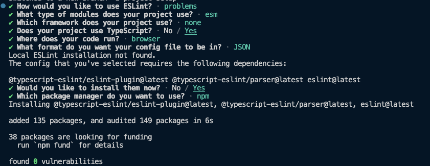

import { Steps, Callout } from 'nextra/components';

# Project Setup

<Steps>
### Vite + Vanilla JavaScript + TypeScript
 
We will use the Vite template with Vanilla JS and TypeScript as our starting point. To get started, run the following command in your terminal:

```sh
npm create vite@latest todo-app -- --template vanilla-ts
```

Then, navigate to the project directory and install the dependencies.

```sh
cd todo-app
npm install
```

Read more about scaffolding a Vite project [here](https://vitejs.dev/guide/#scaffolding-your-first-vite-project).

### Git

Who doesn't use Git these days? We will use Git to manage our code versioning.

To initialize a Git repository, run the following command in your terminal:

```sh
git init
```

### Prettier: The Opinionated Code Formatter

<Callout>
  Why should we even care about formatting our code? Well, it is a good practice
  to have a consistent code style across your project. It makes it easier for
  other developers to read and understand your code. It also makes it easier to
  spot errors and bugs.
</Callout>

We pretty much follow the same install instructions from the [Prettier Docs](https://prettier.io/docs/en/install).

Prettier is not just used as a VSCode extension, but also as a CLI tool to format your code. We will use it to format our code before committing it to Git. To install it, run the following command in your terminal:

```sh
npm install --save-dev --save-exact prettier
```

Then, create an empty config file.

```sh
node --eval "fs.writeFileSync('.prettierrc','{}\n')"
```

and add the following to it. Feel free to change the values to your liking (this is what I prefer):

```json
{
  "trailingComma": "all",
  "tabWidth": 2,
  "semi": true,
  "singleQuote": true,
  "printWidth": 80
}
```

We also want to **not** format certain files. In this project, we would not have such files but it is still a good idea to create one. Create a `.prettierignore` file and add the following:

```sh
# Ignore artifacts:
build
coverage
```

We can now format all files in our project by running the following command in our terminal:

```sh
npx prettier . --write
```

Let us simplify this for our project by adding it as a script.

Update your `package.json` file to include the following:

```json filename="package.json" {7} showLineNumbers
{
  // Omited other properties for brevity
  "scripts": {
    "dev": "vite",
    "build": "tsc && vite build",
    "preview": "vite preview",
    "format": "prettier . --write"
  }
  // Omited other properties for brevity
}
```

### Prettier: Editor Integration

We assume that you are using VSCode as your editor. If not, you can still follow along but you will have to figure out how to integrate Prettier with your editor. Guide for other editors can be found [here](https://prettier.io/docs/en/editors).

Install the Prettier extension for VSCode. You can find it [here](https://marketplace.visualstudio.com/items?itemName=esbenp.prettier-vscode).

We want to use Prettier as the default formatter and also format our code automatically when we save a file. To do this, we need to add the following to our VSCode settings:

```json
"editor.defaultFormatter": "esbenp.prettier-vscode",
"editor.formatOnSave": true
```

You can also do this through the UI. Open the VSCode settings and search for `formatOnSave`. Check the box to enable it. Then, search for `defaultFormatter` and select `esbenp.prettier-vscode`.

### ESLint

ESLint is a tool for finding and fixing bugs in our JavaScript code. It also helps us to enforce code style and formatting conventions.

To quickly set up ESLint, run the following command in your terminal:

```sh
npm init @eslint/config
```

You will be prompted to answer a few questions. Here are the options we should select:

- **How would you like to use ESLint?**
  - To check syntax and find problems (why not also enforce code style? Because prettier does a better job at that)
- **What type of modules does your project use?**
  - JavaScript modules (import/export)
- **Which framework does your project use?**
  - None of these
- **Does your project use TypeScript?**
  - Yes
- **Where does your code run?**
  - Browser
- **What format do you want your config file to be in?**
  - JSON

Use the below image as a reference:


After answering the questions, you will see a `.eslintrc.json` file in your project directory. It should look something like this:

```json filename=".eslintrc.json" showLineNumbers
{
  "env": {
    "browser": true,
    "es2021": true
  },
  "extends": ["eslint:recommended", "plugin:@typescript-eslint/recommended"],
  "parser": "@typescript-eslint/parser",
  "parserOptions": {
    "ecmaVersion": "latest",
    "sourceType": "module"
  },
  "plugins": ["@typescript-eslint"],
  "rules": {}
}
```

Let us also update our `package.json` to add a script to run eslint.

```json filename="package.json" {8} showLineNumbers
{
  // Omited other properties for brevity
  "scripts": {
    "dev": "vite",
    "build": "tsc && vite build",
    "preview": "vite preview",
    "format": "prettier . --write",
    "lint": "eslint ."
  }
  // Omited other properties for brevity
}
```

Since the formatting rules can sometimes conflict with Prettier, we will use the [eslint-config-prettier](https://github.com/prettier/eslint-config-prettier#installation) to handle these conflicts.

To install it, run the following command in your terminal:

```sh
npm install --save-dev eslint-config-prettier
```

Then, update your `.eslintrc.*` file to extend the `eslint-config-prettier` config (it is just the string `prettier`):

```js {9} showLineNumbers
{
  "env": {
    "browser": true,
    "es2021": true
  },
  "extends": [
    "eslint:recommended",
    "plugin:@typescript-eslint/recommended",
    "prettier"
  ],
  "parser": "@typescript-eslint/parser",
  "parserOptions": {
    "ecmaVersion": "latest",
    "sourceType": "module"
  },
  "plugins": ["@typescript-eslint"],
  "rules": {}
}
```

### Git Hooks

Git hooks are scripts that run automatically every time a particular event occurs in a Git repository. We will use it to run Prettier and ESLint before we commit our code.

This will ensure that we do not commit code that does not follow our code style and formatting conventions.

Install Husky and lint-staged while also setting husky script and a pre-commit hook by running the following commands in your terminal:

```sh
npm install --save-dev husky lint-staged
npx husky init
node --eval "fs.writeFileSync('.husky/pre-commit','npx lint-staged\n')"
```

Then, update your `package.json` file to include the following:

```json filename="package.json" {10-17} showLineNumbers
{
  // Omited other properties for brevity
  "scripts": {
    "dev": "vite",
    "build": "tsc && vite build",
    "preview": "vite preview",
    "format": "prettier . --write",
    "lint": "eslint .",
    "prepare": "husky"
  },
  "lint-staged": {
    "src/**/*.{js,ts,jsx,tsx}": [
      "eslint --fix",
      "prettier --write --ignore-unknown"
    ],
    "!src/**/*.{css,json,md,yml}": ["prettier --write --ignore-unknown"]
  },
  "devDependencies": {
    // Omited other properties for brevity
  }
}
```

Now, every time you commit your code, Prettier and ESLint will run on the files that are being committed. Also, we prevent a race condition by not allowing ESLint and Prettier to run on the same files at the same time. Read more about configuring lint-staged [here](https://github.com/lint-staged/lint-staged?tab=readme-ov-file#configuration)

### Great! Now, we are all set to start coding!

WORK IN PROGRESS

{/* At this point, your code should be a good match to the branch of the repository: [1-project-setup](https://github.com/Frontend-Hire/todo-app-react-tdd-typescript/tree/1-project-setup) */}

</Steps>
