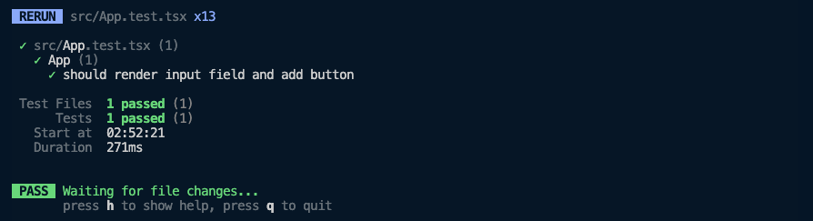
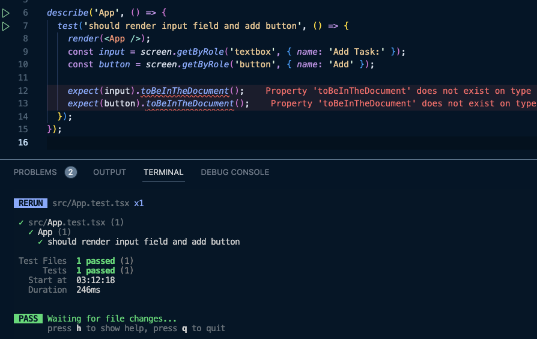

import { Steps, Callout } from 'nextra/components';

# Writing tests

Let us see where we are currently, run the dev server and open the respective dev URL as shown by Vite in your browser.

```sh
npm run dev
```

Also, buckle up, this is going to be a long ride.

## Render Test

Now, as a frontend developer it is easier to work with visible things. We already know that the component is visible in the browser. 

But, why do even need to test it? Writing tests for this seems futile. Right now, the component is very simple. But, as the component grows, it will become more complex and we cannot be sure that any new changes will not cause regressions.

So, writing tests to confirm our current behavior is a good idea. Let us write a test to confirm that the input and button are rendering in the browser.

<Steps>

### Test Structure

Create a new file `App.test.tsx` in the `src` folder. This will pretty much contains the tests for the entire App component.

```tsx showLineNumbers {1-5} filename="./src/App.test.tsx"
import { describe, test } from 'vitest';

describe('App', () => {
  test('should render input field and add button', () => {});
});
```
As we previously wrote a sample test for the `sum` function. Every test should have a meaningful name. The test name should describe what the test is doing. In this case, we are testing if the App component renders the input field and the add button. (read more about [test API here](https://vitest.dev/api/#test))

Describe is used to group tests. It is not necessary to use describe, but it is a good practice to group tests. It helps in organizing the tests and also helps in debugging. (read more about [describe API here](https://vitest.dev/api/#describe))

### Render Component for Testing

We need to render the component in the test. We can use the `render` function from `@testing-library/react` to render the component. (read more about [render API here](https://testing-library.com/docs/react-testing-library/api#render))

```tsx showLineNumbers {2-3,7} filename="./src/App.test.tsx"
import { describe, test } from 'vitest';
import { render } from '@testing-library/react';
import App from './App';

describe('App', () => {
  test('should render input field and add button', () => {
    render(<App />);
  });
});
```

### Query the DOM

We need to query the DOM to check if the input field and the button are present.

There are various queries that we can use. In general, following the guidelines of RTL (read the [priority here](https://testing-library.com/docs/queries/about#priority)) for the query priority order is a good idea.

To summarise at a high level, we need to use the queries that are closest to the user. In our case:
- We'll use `getByRole` to query the input and the button.

```tsx showLineNumbers {9-10} filename="./src/App.test.tsx"
import { describe, expect, test } from 'vitest';
import { render, screen } from '@testing-library/react';
import App from './App';

describe('App', () => {
  test('should render input field and add button', () => {
    render(<App />);

    const input = screen.getByRole('textbox', { name: 'Add Task:' });
    const button = screen.getByRole('button', { name: 'Add' });
  });
});
```

### Assert

We have the elements. Now, we need to assert that they are present in the DOM. We can use the `expect` function from `vitest` to assert. (read more about [expect API here](https://vitest.dev/api/expect.html#expect))

And also use the `toBeDefined` matcher to check if the element is defined or not. (read more about [toBeDefined matcher here](https://vitest.dev/api/expect.html#tobedefined))

```tsx showLineNumbers {12-13} filename="./src/App.test.tsx"
import { describe, expect, test } from 'vitest';
import { render, screen } from '@testing-library/react';
import App from './App';

describe('App', () => {
  test('should render input field and add button', () => {
    render(<App />);

    const input = screen.getByRole('textbox', { name: 'Add Task:' });
    const button = screen.getByRole('button', { name: 'Add' });

    expect(input).toBeDefined();
    expect(button).toBeDefined();
  });
});
```

### Run the Test

Now, run the test and see if it passes.

```sh
npm run test
```

The test should pass with an output like this:


### Improving the Test

Now, `toBeDefined` is not the best matcher to use here. We can use `toBeInTheDocument` matcher from `@testing-library/jest-dom` to check if the element is present in the DOM. (read more about [toBeInTheDocument matcher here](https://testing-library.com/docs/queries/about#priority))
- Read [this stackoverflow answer here](https://stackoverflow.com/questions/73783371/difference-between-tobeinthedocument-and-tobedefined) to understand the difference between `toBeDefined` and `toBeInTheDocument`.

So, let us install `@testing-library/jest-dom` and use the `toBeInTheDocument` matcher.

```sh
npm install -D @testing-library/jest-dom
```

We will actually import the `vitest` compatible version of `@testing-library/jest-dom` from `@testing-library/jest-dom/vitest`. (read more about [vitest compatible version here](https://github.com/testing-library/jest-dom?tab=readme-ov-file#with-vitest))

And it would import the entire thing. 

```tsx showLineNumbers {3,12-13} filename="./src/App.test.tsx"
import { describe, expect, test } from 'vitest';
import { render, screen } from '@testing-library/react';
import '@testing-library/jest-dom/vitest';
import App from './App';

describe('App', () => {
  test('should render input field and add button', () => {
    render(<App />);
    const input = screen.getByRole('textbox', { name: 'Add Task:' });
    const button = screen.getByRole('button', { name: 'Add' });

    expect(input).toBeInTheDocument();
    expect(button).toBeInTheDocument();
  });
});
```
Run the test again and it should pass.

The `jest-dom` import (line 3 in the above snippet) usually happens in a separate setup file for all the tests in our application. We will do that now as a good practice. 

Create a new file `setupTests.ts` at the root of the project and add the import there.

```tsx showLineNumbers {1} filename="./setupTests.ts"
import '@testing-library/jest-dom/vitest';
```

And remove the import from the test file.

```tsx showLineNumbers {3} filename="./src/App.test.tsx"
import { describe, expect, test } from 'vitest';
import { render, screen } from '@testing-library/react';
// removed the import from here
import App from './App';

describe('App', () => {
  test('should render input field and add button', () => {
    render(<App />);
    const input = screen.getByRole('textbox', { name: 'Add Task:' });
    const button = screen.getByRole('button', { name: 'Add' });

    expect(input).toBeInTheDocument();
    expect(button).toBeInTheDocument();
  });
});
```

We also have to update our `vite.config.ts` to use this file as a setup file. (read more about [setup files here](https://vitest.dev/config/#setupfiles))

```tsx showLineNumbers {10} filename="./vite.config.ts"
/// <reference types="vitest" />
import { defineConfig } from 'vite';
import react from '@vitejs/plugin-react';

// https://vitejs.dev/config/
export default defineConfig({
  plugins: [react()],
  test: {
    environment: 'jsdom',
    setupFiles: './setupTests.ts',
  },
});
```

Run the test again and it should pass. But you'll see an error related to TypeScript despite the tess passing.


This is because the `setupTests.ts` file is not being included by TypeScript in our project. Let's update our `tsconfig.json` to include this file.

```json {5} filename="./tsconfig.json"
{
  "compilerOptions": {
    /* Some of the options omitted for brevity */
  },
  "include": ["src", "./setupTests.ts"],
  "references": [{ "path": "./tsconfig.node.json" }]
}
```

Save the file and the error should go away.
</Steps>

Great, we wrote our first test that is actually useful. But, we are not done yet. We need to test the further functionality of the component.

Before we move on, let us use an eslint plugin to help us write better tests. Install `eslint-plugin-testing-library` and `eslint-plugin-jest-dom` as dev dependencies. These plugins will help us write better tests.

```sh
npm install -D eslint-plugin-testing-library eslint-plugin-jest-dom
```

And let us add them to our `.eslintrc.cjs` file.

```json {7-8} filename=".eslintrc.cjs"
module.exports = {
  /* Rest of the options omitted for brevity */
  extends: [
    'eslint:recommended',
    'plugin:@typescript-eslint/recommended',
    'plugin:react-hooks/recommended',
    'plugin:jest-dom/recommended',
    'plugin:testing-library/react',
    'prettier',
  ],
  /* Rest of the options omitted for brevity */
};
```

## Testing the user interaction

Work in progress....

At this point your code should be a good match to the branch of the repository: [5-writing-tests](https://github.com/yaralahruthik/todo-app/tree/5-writing-tests)